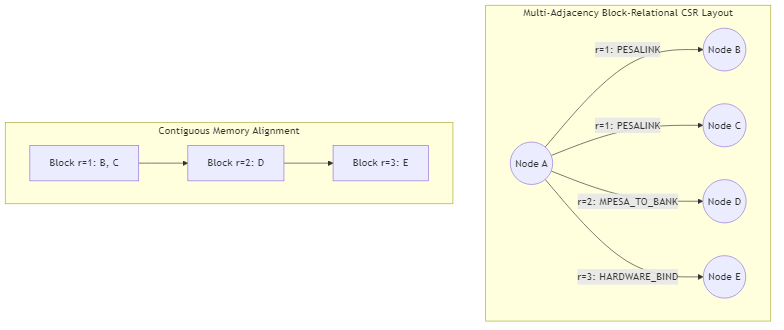
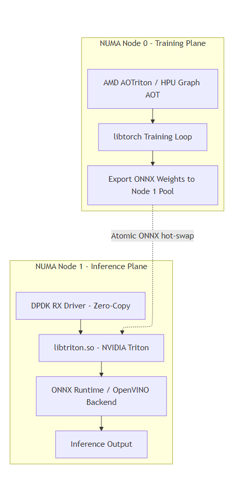
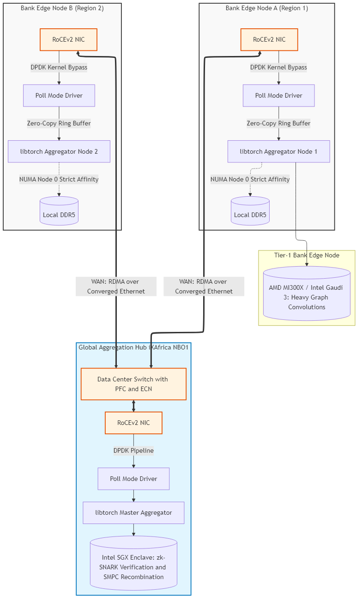

# Privacy-Preserving Interbank Fraud Detection Network for the PesaLink Ecosystem

Kenya's financial technology landscape occupies an advanced position in global payment systems history. The nation catalyzed the mobile money revolution through M-Pesa and constructed a sophisticated real-time payment ecosystem. At the operational heart of the interbank dimension resides PesaLink, operated by Integrated Payment Services Limited, facilitating instantaneous financial connections among over eighty distinct financial institutions. The rapid digitization of this retail banking sector successfully catalyzed national financial inclusion but simultaneously introduced complex operational vulnerabilities. Real-time digital banking fraud has escalated to absolute crisis levels. According to the Central Bank of Kenya, annual systemic digital fraud losses categorized under Net Financial Defalcation Losses reached a staggering KES 1.50 billion. This explosive growth necessitates an immediate, structurally profound architectural response. The core challenge lies in the PesaLink network itself, operating as a dynamically evolving bipartite graph. Traditional fraud detection systems operate in restrictive data silos, structurally failing to detect inter-bank transaction topology and multi-hop laundering patterns. However, pooling unencrypted databases into a centralized data lake violates strict data minimization principles mandated by the Kenya Data Protection Act of 2019. This document outlines a decentralized, privacy-preserving, highly hardware-isolated real-time fraud detection architecture based on Federated Graph Neural Networks to secure the national infrastructure.

## Table of Contents
* 1. [The Kenyan Digital Payment Landscape](#1-the-kenyan-digital-payment-landscape)
  * 1.1 [Quantitative Fraud Metrics and CBK Prudential Guidelines](#11-quantitative-fraud-metrics-and-cbk-prudential-guidelines)
  * 1.2 [Judicial Precedent: The DTB and Safaricom Case](#12-judicial-precedent-the-dtb-and-safaricom-case)
* 2. [Mathematical Framework and Graph Topology](#2-mathematical-framework-and-graph-topology)
  * 2.1 [Scale-Free Bipartite Graph Formulations](#21-scale-free-bipartite-graph-formulations)
  * 2.2 [Fraud Transactions and Specific Graph Topologies](#22-fraud-transactions-and-specific-graph-topologies)
  * 2.3 [Memory Explosion Mitigation and Dynamic Hop Calculations](#23-memory-explosion-mitigation-and-dynamic-hop-calculations)
  * 2.4 [Temporal Dynamics and Multi-Adjacency CSR Layouts](#24-temporal-dynamics-and-multi-adjacency-csr-layouts)
* 3. [Hardware Acceleration and Edge Software](#3-hardware-acceleration-and-edge-software)
  * 3.1 [FPGA Line-Rate Ingestion and Feature Engineering](#31-fpga-line-rate-ingestion-and-feature-engineering)
  * 3.2 [NUMA Isolation and Huge Page Pool Architecture](#32-numa-isolation-and-huge-page-pool-architecture)
* 4. [Federated Orchestration and Network Architecture](#4-federated-orchestration-and-network-architecture)
  * 4.1 [Temporal Decay Asynchronous Federated Averaging](#41-temporal-decay-asynchronous-federated-averaging)
  * 4.2 [Dual-Regularization: Focal Loss and Gradient Sparsification](#42-dual-regularization-focal-loss-and-gradient-sparsification)
  * 4.3 [Strategic Data Center Selection and Bare-Metal Colocation](#43-strategic-data-center-selection-and-bare-metal-colocation)
* 5. [Cryptography, Privacy, and Explainability](#5-cryptography-privacy-and-explainability)
  * 5.1 [Differentially Private Stochastic Gradient Descent](#51-differentially-private-stochastic-gradient-descent)
  * 5.2 [Zero-Knowledge Proofs and Trusted Execution Environments](#52-zero-knowledge-proofs-and-trusted-execution-environments)
  * 5.3 [Regulatory Explainability via Monte Carlo Tree Search](#53-regulatory-explainability-via-monte-carlo-tree-search)
* 6. [Project Finance, Unit Economics, and Deployment Policy](#6-project-finance-unit-economics-and-deployment-policy)
  * 6.1 [Tiered Infrastructure Capital Expenditure](#61-tiered-infrastructure-capital-expenditure)
  * 6.2 [Network Peering and Algorithmic Penalties](#62-network-peering-and-algorithmic-penalties)
* 7. [Glossary](#7-glossary)

## 1. The Kenyan Digital Payment Landscape

### 1.1 Quantitative Fraud Metrics and CBK Prudential Guidelines

The operational environment for Kenyan financial institutions is strictly governed by a dual regulatory mandate that inadvertently creates a profound structural paradox for compliance officers. On one side of this regulatory spectrum, the Central Bank of Kenya enforces stringent operational risk management standards designed to protect the national economy. The Central Bank of Kenya Prudential Guidelines dictate that all licensed banks must maintain highly robust internal control structures capable of preemptively mitigating technological threats before they manifest into systemic contagion. Financial institutions are unequivocally required to treat cyber fraud as a material threat to their core capital adequacy, mandating that projected fraud losses must be meticulously provisioned as direct operational risk exposure on their balance sheets. Furthermore, Kenya's recent placement on the Financial Action Task Force grey list, which directly reflects systemic national deficiencies in anti-money laundering and counter-financing of terrorism frameworks, has compelled the Central Bank of Kenya to issue immediate directives requiring all supervised institutions to implement automated real-time transaction monitoring systems. Manual, post-event forensic reviews are no longer deemed acceptable as a primary security control layer. This rigorous regulatory landscape is heavily influenced by the catastrophic surge in digital banking fraud, which has grown exponentially over the past calendar year as explicitly illustrated in **Table 1** below.

**Table 1**: Quantitative fraud metrics (+130.72% year-on-year surge).

| Fraud Metric | 2023 | 2024 | Percentage Increase |
| :--- | :--- | :--- | :--- |
| Total Reported Fraud Cases | 153 | 353 | +130.72% |
| Total Financial Exposure Value | KES 680.9 million | KES 1.90 billion | +179.04% |
| Net Financial Defalcation Losses | KES 412.0 million | KES 1.50 billion | +264.08% |
| Card-Specific Fraud Losses | KES 15.50 million | KES 263.29 million | +1,598.65% |
| Identity Theft / Impersonation Losses | KES 33.16 million | KES 199.00 million | +500.12% |

Source: [1] Central Bank of Kenya, "Bank Supervision Annual Report 2024" and "Financial Sector Stability Report 2024," Nairobi, 2024. [Online]. Available: https://www.centralbank.go.ke/reports/bank-supervision-and-banking-sector-reports/

### 1.2 Judicial Precedent: The DTB and Safaricom Case

This strict regulatory stance has been forcefully validated by the Kenyan judicial system in recent months. In a landmark judicial decision delivered on July 13, 2026 by the High Court of Kenya at Machakos, a commercial bank (Diamond Trust Bank, commonly known as DTB) and a major telecommunications provider (Safaricom) were held strictly liable and had specific financial liability apportioned (Safaricom 60%, DTB 40%) for a KES 4.42 million digital fraud loss in a highly coordinated SIM swap attack [2]. The court systematically rejected the historical automated defense mechanism traditionally utilized by the financial sector, which previously argued that because a transaction utilized the correct personal identification number (PIN) and occurred within standard system withdrawal limits, the institution was absolved of any legal liability. Instead, the judicial ruling explicitly established that the sheer velocity and highly anomalous structural pattern of the illicit transactions constituted a clearly detectable fraud signature that should have triggered immediate institutional intervention. Consequently, financial institutions are now legally obligated to deploy predictive, behavior-aware anomaly detection architectures rather than merely relying on reactive, rule-based blocking systems. The legal precedent effectively shifts the burden of proof, demanding that banks understand the contextual mathematical structure of all transactions to identify sophisticated laundering loops before funds irrevocably exit the institutional perimeter.

[2] Tech-Ish, "Court Rules a Correct PIN Is Not a Defence: Safaricom and DTB to Pay KES 4.4M SIM Swap Victim," July 13, 2026. [Online]. Available: https://tech-ish.com/2026/07/13/safaricom-dtb-sim-swap-ruling/

## 2. Mathematical Framework and Graph Topology

To ensure absolute clarity for all stakeholders before diving into the advanced neural mathematics, it is highly beneficial to first understand the fundamental terminology of a graph network in layman's language. In the simplest possible terms, a **node** (often referred to as a vertex in academic literature) simply represents a unique, distinct entity existing in the real world. In the context of the PesaLink ecosystem, a node could be a specific retail customer's bank account, a digital mobile money wallet, a corporate merchant till, or a physical automated teller machine. An **edge** is the specific relationship or definitive action that actively connects two different nodes together. For our purposes, an edge strictly represents a specific financial transaction, such as sending five thousand shillings from Alice's bank account to Bob's mobile wallet. Finally, the **topology** is the overall structural shape or visual pattern that all of these continuous connections create when viewed from a high altitude, much like looking at a bustling map of airplane flight paths actively connecting global airports. By meticulously analyzing the unique shape of these intricate connections rather than just the isolated database rows within them, the overarching system can instantly spot the distinct, anomalous behaviors of coordinated fraud syndicates.

### 2.1 Scale-Free Bipartite Graph Formulations

The global interbank transaction network operates as a highly dynamic, multi-relational directed graph mathematically defined as G = (V, E, R, X, Y, T). In this complex topological formulation, X represents the continuous node and discrete edge feature matrices, Y represents the ternary action classification labels (Block, Approve, Review), and T represents the continuous timestamp domain governing sequential transaction execution. In this architectural framework, the vertex set V represents heterogeneous node entities corresponding to completely unique endpoints scattered within the national banking grid. These digital endpoints are explicitly categorized into distinct structural classes to accurately capture the sheer complexity of the underlying financial ecosystem. The relational set R formally defines discrete edge classifications representing highly specific transactional contexts such as loan disbursements or peer-to-peer transfers, while the directed edge set E consists of mathematical triplets denoting a direct flow of value or digital interaction from one specific origin node to another destination node under a specific semantic relation. Each individual transfer edge is richly parameterized by an extensive edge feature vector explicitly defined by its financial amount, the precise temporal duration since the last transaction, the routing channel code, and the sequential execution rank. To process this massive interconnected graph efficiently within severely memory-constrained computational environments, all interacting nodes are cast directly into memory as uniform 64-bit unsigned integers. The top four binary bits of each integer are permanently reserved to define the precise entity type, ensuring rapid categorical classification during live network inference. As detailed in **Table 2**, these entity types are assigned specific Type IDs and baseline dimensionalities. The structural isolation of these core node categories allows the Graph Neural Network to properly weigh completely different feature vectors, distinguishing a mobile wallet's daily limits from a physical ATM's geographic coordinates during active inference.

**Table 2**: Core graph node entity types and structural feature targets.

| Type ID | Entity Type | Primary Key Extraction Target | Baseline Dimension ($d$) | Core Intrabank Feature Elements ($X_v$) |
| :--- | :--- | :--- | :--- | :--- |
| 0x1 | Customer Account | Bank Routing + Numeric Acc No. | 128 | KYC Tier level, Account Age, 24h Debits Sum, Overdraft status |
| 0x2 | Mobile Wallet | MSISDN (Phone Number via M-Pesa) | 128 | Identity verification status, Device SIM card age, Daily cash-out limits |
| 0x3 | Device Identifier | Hardware IMEI / IMSI hash string | 64 | Device registration age, Unique linked IP count, Rooted status flag |
| 0x4 | Access Endpoint | USSD Shortcode / Agent ID / ATM | 64 | Geographic coordinates, Local liquidity limits, Historical failure rates |

### 2.2 Fraud Transactions and Specific Graph Topologies

Traditional rule-based systems analyze retail transactions in complete isolation, completely ignoring the broader economic context. Conversely, a Graph Neural Network mathematically evaluates the entire topology of the financial ecosystem in real-time, mapping complex relationships as nodes and edges. Fraud syndicates systematically leverage immense networks of dormant or fraudulently-opened accounts to receive illicit funds without triggering standard volume thresholds. These compromised nodes exhibit a very distinctive in-degree spike followed immediately by a rapid out-degree in temporal graph analysis: high in-flow velocity originating from victims, followed by a single terminal withdrawal edge at a physical agent node or automated teller machine. 

One highly specific adversarial topology is **SIM Swap and Identity Hijacking (Device Substitution)**. Fraudsters frequently execute illegal SIM card replacements via telecommunications retailer networks, intercepting one-time passwords to authenticate digital banking sessions. Once in control of the victim's registered mobile number, they perform credential resets and initiate high-velocity outbound transfers. In graph terms, this produces a sudden device node substitution: the legitimate account node disconnects from its historical device node and immediately binds to a new, previously-unseen device node. Coupled with rapid transaction structuring deliberately designed to stay below the enhanced scrutiny threshold (e.g., KES 500,000), the graph neural network instantly flags the explosive velocity and structural links to zero-history nodes as a severe anomaly.

Another critical adversarial topology frequently observed in the PesaLink ecosystem is **Smurfing and Layering Networks (The Structuring Fan-Out)**. Criminal syndicates often attempt to move massive volumes of illicit cash by distributing funds across multiple destination "mule" accounts in small increments. This two-hop laundering pattern creates a massive fan-out subgraph from a single source to multiple dormant recipient nodes, which then aggressively push the funds across multiple extra financial hops before eventually converging into a single terminal sink node utilized for physical cash withdrawal. The topological graph transitions rapidly from a single source node, splits outward into a wide parallel array of unique intermediate network nodes, and then instantly contracts back into a single terminal sink. This forms a massive butterfly or hourglass structure that is recognized effortlessly by structural coherence matrices operating within the spatial embedding dimensions, thereby exposing the entire syndicate architecture to immediate regulatory review.

### 2.3 Memory Explosion Mitigation and Dynamic Hop Calculations

Tier 2 banks and microfinance institutions form a sparse financial periphery characterized by highly directed, deeply linear transaction chains that lack the massive interconnectivity of the primary clearing hubs. To achieve perfectly deterministic inference times and proactively prevent the catastrophic neighborhood explosion problem during real-time model execution, the overarching software architecture enforces a strictly mathematically bounded two-hop neighborhood limit, denoted algebraically as K=2. Furthermore, an asymmetric uniform node sampling strategy is actively applied to the graph traversal engines, constraining the maximum sampled neighbor vectors to exactly fifteen at the primary first hop and exactly ten at the secondary second hop. This highly optimized sampling protocol mathematically guarantees a strict neighborhood execution budget strictly bounded to $N = 1 + K_1 + (K_1 \times K_2) = 1 + 15 + (15 \times 10) = 166 \text{ nodes}$. To properly demonstrate the severe neighborhood explosion problem mathematically, the underlying formula for the maximum theoretical neighborhood budget expands exponentially at each subsequent network hop. The general mathematical formula defining the total node budget for $H$ hops is rigorously calculated as:

$$N = 1 + \sum_{h=1}^H \prod_{i=1}^h K_i$$

If we assume the federated system were to hypothetically continue to strictly throttle the outer exploratory hops to just ten samples (so $K_1=15, K_2=10, K_3=10, K_4=10$), the computational inference budget would explode immensely. By just attempting to traverse to four hops, a single individual transaction inference suddenly requires fetching, holding in silicon cache, and computing complex vector math across a staggering 16,666 nodes instead of a highly manageable 166 nodes. Because these mission-critical financial models operate under extremely strict service level agreements requiring hard sub-50 millisecond latency, pulling thousands of disparate node feature vectors randomly from physical memory causes catastrophic cache thrashing and Translation Lookaside Buffer misses across the motherboard. This exponential mathematical reality is exactly why the architecture rigidly and mathematically bounds the peripheral graph inferences at exactly two hops, preserving absolute system stability.

### 2.4 Temporal Dynamics and Multi-Adjacency CSR Layouts

To successfully sustain sub-50 millisecond inference latency across the national grid, traditional Compressed Sparse Row memory architectures are completely eradicated and replaced entirely with a highly optimized Multi-Adjacency Block-Relational CSR layout. Standard single-relational memory arrays heavily require conditional software branching to separate completely different transaction types, which inadvertently invalidates CPU branch prediction states and totally stalls vector processing lanes on the central processing unit. The advanced Block-Relational format mathematically eliminates this severe computational bottleneck by systematically grouping contiguous target neighbor vectors sorted internally by their exact relation identifiers. This innovative layout explicitly enables perfectly deterministic, linear vector loading directly into massive one-gigabyte hugepages securely allocated via the Data Plane Development Kit kernel bypass framework, exactly as visualized in **Figure 1** below. By formally introducing a continuous-time dynamic graph mathematical formulation, the precise temporal evolution of all financial relationships is captured explicitly by the neural network. The temporal graph is rigorously defined as a sequence of discrete graph snapshots or as a continuous, unbounded stream of time-stamped interaction edges. This continuous temporal representation is absolutely paramount for successfully detecting rapid velocity structuring attacks, wherein malicious syndicate actors execute a high volume of tiny transactions within microscopic time windows to evade detection. The direct integration of temporal dynamics structurally requires augmenting the static adjacency matrix with a continuously time-decaying weight matrix. To accurately capture temporal dynamics natively inside the deep neural network architecture, continuous-time sinusoidal Fourier embeddings are applied directly to the temporal edges, effectively mapping the exact transaction timestamp into the latent manifold space for deep analysis.

**Figure 1: Multi-Adjacency Block-Relational CSR Layout**

## 3. Hardware Acceleration and Edge Software

### 3.1 FPGA Line-Rate Ingestion and Feature Engineering

The overarching fraud detection architecture aggressively utilizes Advanced Micro Devices and Xilinx Field Programmable Gate Array SmartNICs, specifically targeting the high-performance Alveo series, seamlessly combined with the Data Plane Development Kit to capture and accurately parse international banking messages at true ultra-low latency. By entirely bypassing the standard Linux operating system kernel network stack, the integrated system completely eliminates packet jitter and massive processor overhead to guarantee that the core compute nodes receive structured financial data exactly at wire line rate. Crucially, the dedicated hardware silicon is solely responsible for executing both line-rate data ingestion and highly complex real-time feature engineering specifically deployed at the Tier 2 banking endpoints. Deep mathematical preprocessing tasks are aggressively offloaded entirely to the complex programmable logic gates housed within the SmartNIC interface. This comprehensive algorithmic offloading includes executing highly parallelized geohashing calculations, determining the exact temporal duration elapsed since the precise last transaction, and rapidly computing dynamic transaction velocity metrics without ever interrupting the central processor. Furthermore, the specialized hardware intelligently handles the real-time bit-mapping of customer accounts as strictly new in order to instantly trigger inductive learning operations or smoothly initiate dense vector projections during the very first network interaction. This profound hardware optimization drastically accelerates the structural feature extraction pipeline long before the financial data ever actually reaches the Graph Neural Network inference model, allowing the overarching system to easily maintain absolute dominance over the strict regulatory timing mandates established by the central banking authority.

### 3.2 NUMA Isolation and Huge Page Pool Architecture

To proactively prevent the real-time inference computational path from actively competing with the background federated training algorithms for limited memory bandwidth, the operating system enforces extremely strict Non-Uniform Memory Access topology-aware pool segregation at the lowest kernel level. To completely prevent standard scheduler jitter and hardware interrupt handling from severely interrupting the critical, latency-sensitive inference path, the Linux kernel is securely booted with incredibly strict central processing unit isolation parameters. The two massive hardware sockets of the host enterprise server are explicitly assigned mutually exclusive operational roles to guarantee stability. NUMA Node 0 is permanently allocated to raw transaction graph construction, local mathematical backpropagation, active kernel compilation, and highly complex gradient sparsification routines. The operating system proactively pre-allocates gigabyte-sized huge pages exclusively on Node 0 to prevent fragmentation. Conversely, NUMA Node 1 is exclusively allocated to the NVIDIA Triton Inference Server, the execution backend frameworks, and processing live transaction feature vectors. The memory Pool B operates strictly in read-only mode during active live inference and is actively written to only during an atomic, zero-downtime hot-swap operation. The central server process is explicitly pinned directly to the hardware to bind the memory allocator strictly to Node 1 huge pages. Cross-node memory contamination is systematically prevented at two distinct architectural levels. First, the Linux kernel's rigorous memory policy completely prevents the training allocator from improperly falling back to Node 1 under severe out-of-memory scenarios via strict control group memory limits. Second, the deep learning caching allocator is totally isolated from the live inference process via completely separate multiprocessing shared memory arenas, as structurally illustrated in **Figure 2**.

**Figure 2: NUMA Node Isolation and Inference Data Plane Architecture**

## 4. Federated Orchestration and Network Architecture

To visualize the integration of these highly complex systems, **Figure 3** elegantly maps the precise flow of packets from the banking network edge directly into the global aggregation hub. It highlights the explicit use of DPDK kernel bypass mechanisms, strict NUMA affinity protocols, and the deployment of the libtorch C++ aggregation engine over the loss-less RoCEv2 primary fabric. In the event of a physical primary circuit failure, the architecture seamlessly falls back to the iWARP protocol, ensuring highly reliable gradient delivery over standard lossy TCP/IP backup WAN circuits without requiring hardware changes.

**Figure 3: Comprehensive Federated Network Architecture and Global Aggregation Flow**

### 4.1 Temporal Decay Asynchronous Federated Averaging

Collaborative machine learning model training occurs securely without ever exposing raw customer ledger data through the highly specialized implementation of Federated Averaging algorithms deployed across the entire banking network. Centralized transactional databases are deliberately and permanently replaced with localized, hardware-isolated training environments where participating commercial banks compute deep mathematical gradients internally within their own extremely secure institutional perimeters. To actively mitigate severe synchronization bottlenecks frequently caused by lagging participant nodes operating across highly heterogeneous computing environments where federated edge devices or regional proxy servers exhibit extreme variances in computational processing power, network internet bandwidth, and general server uptime availability, the communication protocol utilizes an advanced Asynchronous Federated Learning continuous update mechanism. The catastrophic degradation of global mathematical model convergence traditionally caused by slow nodes and the severe mathematical instability introduced by integrating highly stale, outdated model updates directly into the global parameters is permanently solved by the Temporal Decay Asynchronous Federated Averaging software architecture. The central aggregating server instantly updates the global model asynchronously as soon as any single client pushes a valid gradient update, deliberately scaling the algorithmic gradient step by a highly specific temporal decay factor that is inversely proportional to the update's exact temporal staleness. Instead of applying a steep, unforgiving exponential decay which actively punishes slow but perfectly honest banking nodes far too aggressively, the network architecture utilizes a highly optimized rational polynomial dampening factor applied directly to the local gradient tensors, ensuring continuous, stable convergence bounds without ever triggering systemic network timeouts.

### 4.2 Dual-Regularization: Focal Loss and Gradient Sparsification

Global financial anomaly detection inherently suffers from an extreme class imbalance problem since over ninety-nine point nine percent of all processed transactions are entirely legitimate and perfectly safe for settlement. However, as evidenced by the Central Bank of Kenya data documenting KES 1.50 billion in net losses, although these fraudulent instances are exceedingly rare in frequency, their financial severity and systemic impact are catastrophic. To successfully rectify this profound structural skew within the dataset, the deep learning optimization pipeline actively employs Focal Loss mathematics to dynamically down-weight the calculated gradients originating from easily classified safe transfers. This highly specific loss function forcefully directs the massive neural network to exclusively concentrate its profound mathematical capacity on identifying hard, severely misclassified fraud patterns that mimic legitimate behavior. Furthermore, an Asymmetric Weighted Edge Loss mechanism actively penalizes the analytical model severely for accidentally misclassifying structural interbank clearing links, explicitly ensuring the overarching system does not artificially maximize its baseline accuracy simply by defaulting to a blanket "Approve" prediction on every transaction. The complex loss function purposefully applies an explicit asymmetric numerical multiplier guaranteeing that dangerous false negatives (e.g., misclassifying a "Block" scenario as an "Approve") incur an exponentially larger gradient penalty than benign false positives (e.g., unnecessarily flagging an "Approve" transaction for "Review"). Network transmission bandwidth overheads during these massive federated gradient updates are simultaneously compressed aggressively using a Top-K Gradient Sparsification mathematical operator. This algorithmic filter actively drops all minor gradient components falling strictly below a dynamically calculated numerical threshold, explicitly transmitting only the highest-magnitude, most critical mathematical updates to the central aggregator, thereby saving massive amounts of interbank network bandwidth while preserving absolute accuracy. The seamless integration of Focal Loss and Top-K Gradient Sparsification creates a highly complex, phenomenally robust optimization landscape, meticulously directing the essential gradients towards the most challenging fraud cases while effortlessly maintaining absolute network efficiency across the disparate, highly isolated banking silos.

### 4.3 Strategic Data Center Selection and Bare-Metal Colocation

To successfully satisfy the strict real-time clearing constraints of the PesaLink switch, graph inference and gradient transmission must complete in under 50 milliseconds. Because data transmission is strictly bound by the speed of light in fiber optic cables (~200km/ms), offshoring these mission-critical compute workloads to standard public clouds in South Africa or Europe is mathematically unviable. It would inevitably trigger transaction timeouts at the core clearing switch and violate the data sovereignty principles enshrined within the Kenya Data Protection Act of 2019.

This absolute physical limitation mandates the utilization of bare-metal colocation within high-density, carrier-neutral Tier III/IV data centers connected via the Kenya Internet Exchange Point (KIXP). The project relies on a highly resilient "peering triangle" utilizing three strategic data center campuses located within the Nairobi Ring:
1. **Primary Aggregation Hub (iXAfrica NBO1):** This purpose-built hyperscale facility hosts the central network coordinator and the primary Trusted Execution Environments. It features direct local loop dark fiber access to major telecommunication providers, establishing the lowest possible latency paths directly to the Kenyan banking cores.
2. **Secondary Disaster Recovery (ADC NBO1):** The Africa Data Centres facility serves as a robust, fully-active secondary aggregation site to maintain uptime during primary site disruptions.
3. **Tertiary Redundancy (iColo NBO1):** Completes the high-availability peering triangle, ensuring that the lossless RoCEv2 Ethernet fabric remains continuously operational across the national grid even during catastrophic, multi-site hardware failures.

## 5. Cryptography, Privacy, and Explainability

### 5.1 Differentially Private Stochastic Gradient Descent

Institutional data privacy is mathematically and cryptographically guaranteed at the local banking edge environment using highly advanced Differentially Private Stochastic Gradient Descent mathematical algorithms. Before any derived mathematical vectors are permitted to leave the highly secure bank firewall, the local numerical gradients are deterministically bounded to severely restrict their analytical sensitivity using a rigorous L2-norm algorithmic clipping function. Following the successful completion of the clipping procedure, highly calibrated Gaussian noise is deliberately injected directly into the batched gradients to permanently obscure the exact transactional footprints of the underlying customers, preventing devastating membership inference attacks entirely and providing incredibly strong, court-admissible mathematical privacy guarantees. The rigorous L2-norm clipping operation, while mathematically straightforward in standard environments, is inherently incredibly difficult to accurately represent within a zero-knowledge arithmetic circuit due to the mandatory required square root numerical calculation. Therefore, the cryptographic architectural design fundamentally replaces the standard Euclidean norm with an infinitely approximated continuous polynomial bound, strictly ensuring that the overall circuit complexity remains securely within tractable computational limits while still explicitly providing the necessary privacy and security guarantees. This advanced cryptosystem ensures that all participant banks can safely contribute to the global fraud detection intelligence model with absolute, provable certainty that their highly proprietary retail customer data and unique institutional trading strategies remain completely hidden from both commercial competitors and the central coordinating regulatory authority. The underlying protocol enables complete collaborative systemic intelligence sharing while remaining securely and permanently within the strict legal boundaries established by domestic privacy frameworks, explicitly satisfying both Section 25 regarding absolute data minimisation and Section 41 mandating comprehensive data protection by design under the Kenya Data Protection Act.

### 5.2 Zero-Knowledge Proofs and Trusted Execution Environments

To completely secure the massive mathematical gradients during external network transit, the platform aggressively employs highly sophisticated Secure Multi-Party Computation cryptographic protocols. The heavily sanitized gradient tensors are systematically decomposed into completely random additive secret shares distributed evenly across multiple independent, geographically separated aggregator nodes. However, a massive fundamental gap exists within the industry regarding the catastrophic computational processing overhead of the Prover during these intense cryptographic exchanges. Generating a zero-knowledge succinct non-interactive argument of knowledge for a massive deep learning model takes significant chronological time on standard enterprise compute infrastructure, rendering it completely impractical for high-frequency, real-time federated updates without employing proper hardware acceleration. The severe lack of optimized arithmetization for complex non-linear activation functions in Zero-Knowledge cryptographic circuits absolutely requires careful, highly detailed mathematical polynomial approximations. Deep learning activation functions such as the LeakyReLU are mathematically approximated using low-degree Taylor polynomials to perfectly fit within the incredibly stringent arithmetic constraints of the circuit, significantly reducing the overall computational processing overhead required by the Prover. To definitively and mathematically prove the strict computational integrity of the local gradients without ever revealing their actual hidden contents, the architecture heavily leverages Groth16 zero-knowledge mathematical proofs. The final cryptographic verification of these zero-knowledge proofs revolves exclusively around a highly optimized constant-time bilinear pairing check executed entirely within the hardware-secured enclaves, strictly ensuring the structural algorithmic execution of the model architecture remains completely untampered prior to global aggregation.

### 5.3 Regulatory Explainability via Monte Carlo Tree Search

Standard black-box Graph Neural Network algorithmic inference outputs predicting the precise mathematical probability of a node or edge being severely fraudulent explicitly require regulatory-mandated explainability to fully comply with modern financial transparency laws. Accurately approximating the true Shapley value of specific network subgraphs is absolutely essential to deeply determine the exact structural contributions of specific transactional pathways to the final algorithmic fraud prediction, providing essential human-readable justifications for all artificial intelligence-driven financial blocking decisions. Traditional baseline Shapley value computational mathematics is formally non-deterministic polynomial-time hard, making it entirely computationally prohibitive to execute for large-scale, real-time transaction graphs containing billions of edges. For real-time algorithmic inference explainability, the true marginal utility of each specific node update is evaluated rapidly within the secure silicon enclaves utilizing a highly optimized Monte Carlo Tree Search mathematical approximation, heavily rewarding honest, accurate nodes while mathematically isolating and penalizing those submitting malicious or noisy updates. The complex search algorithm explicitly evaluates the true marginal contribution of adding nodes to a structural coalition using the neural network's predictive output probability as the internal reward function. The framework highly intelligently navigates the massive combinatorial space of all possible coalition formations, utilizing the advanced Upper Confidence Bound applied to Trees algorithm to perfectly balance the necessary exploration of novel graph structural patterns with the aggressive exploitation of known high-reward fraudulent coalitions. The resulting comprehensive explanations provide highly critical, actionable insights into the fundamental structural dynamics of the illicit fraud rings, explicitly highlighting the precise, step-by-step sequence of multi-hop transactions that successfully triggered the overarching anomaly detection system, thereby perfectly satisfying all strict regulatory compliance reporting mandates.

## 6. Project Finance, Unit Economics, and Deployment Policy

### 6.1 Tiered Infrastructure Capital Expenditure

Successfully deploying a massive privacy-preserving federated graph neural network across an entire national banking switch explicitly requires substantial, well-planned capital expenditure and a meticulously designed, highly resilient financial modeling strategy. The comprehensive deployment strategy strictly mandates that all major Tier 1 financial institutions construct their own completely isolated Trusted Execution Environments natively utilizing advanced Intel Trust Domain Extensions or Advanced Micro Devices Secure Encrypted Virtualization hardware technologies. These exceptionally high-capacity enterprise servers are physically equipped with dedicated, extremely expensive Field Programmable Gate Arrays to successfully handle the massive, unrelenting volume of digital transactions generated continuously by millions of retail banking customers. The estimated capital expenditure for deploying a single, fully equipped Tier 1 institutional deployment node is currently estimated at approximately one hundred and fifty thousand United States Dollars, comprehensively encompassing the massive cost of specialized silicon hardware, high-bandwidth server memory, and complex enterprise-grade cryptographic key management security systems. In stark contrast, local Tier 2 banks and rural microfinance institutions operate on a vastly different, highly constrained economic scale that cannot support massive capital layouts. To actively ensure comprehensive national network coverage without completely bankrupting these much smaller institutions, the software architecture intelligently provides a lightweight, highly optimized peripheral software client. This dedicated client allows Tier 2 institutions to securely and affordably participate in the national federated network by routing their heavily encrypted mathematical gradients through localized regional aggregator hubs. These specific regional hubs actively absorb the heavy, expensive computational lifting associated directly with zero-knowledge proof verification and complex gradient aggregation, successfully socializing the massive infrastructure costs across multiple smaller, financially constrained participants.

### 6.2 Network Peering and Algorithmic Penalties

The ongoing operational expenditure associated with actively maintaining the entire federated network infrastructure is heavily and successfully subsidized by the drastic, systemic reduction in highly expensive manual fraud investigation hours. Currently, participating commercial banks employ many hundreds of dedicated human analysts to manually review thousands of flagged transactions daily, leading to massive, unsustainable operational overhead and extremely severe analyst alert fatigue. By successfully deploying the advanced Graph Attention Networks and the highly transparent Monte Carlo Tree Search explainability modules, the overall system dramatically reduces the baseline false positive alert rate, strictly ensuring that highly paid human analysts only investigate highly probable, deeply complex organized fraud syndicates rather than simple clerical errors. The overarching deployment policy strictly and unequivocally mandates a slow, highly phased software rollout to definitively ensure absolute systemic stability across the national grid. The initial deployment phase focuses exclusively on deploying the specialized hardware accelerators and complex cryptographic enclaves solely within the top five largest Tier 1 banks, successfully establishing the foundational, highly secure federated ring. During this highly critical initial phase, the neural networks actively operate in a silent shadow mode, silently observing live retail transactions and computing mathematical gradients without actively blocking any actual customer funds. The strict peering policy directly governing this massive federated network requires all participating financial institutions to strictly adhere to comprehensive service level agreements regarding minimum node server uptime and strict gradient submission latency requirements. Institutions that consistently and repeatedly fail to meet these stringent requirements or actively submit poisoned, malicious mathematical gradients are automatically and algorithmically penalized by the highly advanced Guided Truncation Gradient Shapley mechanism, which severely degrades their internal reputation score and eventually completely isolates them from the global model updates to protect the integrity of the national banking switch.

## 7. Glossary

* **DPDK (Data Plane Development Kit)**: A specialized set of data plane libraries and network interface controller polling-mode drivers designed to offload TCP packet processing directly from the operating system kernel to processes running in user space, completely eliminating software jitter.
* **DP-SGD (Differentially Private Stochastic Gradient Descent)**: An advanced algorithmic training mechanism that mathematically injects calibrated statistical noise into neural network gradients to rigorously protect the absolute privacy of the underlying retail banking training data against membership inference attacks.
* **Federated Averaging**: A collaborative, decentralized machine learning technique where multiple independent edge devices train local models and only share their calculated weight updates (gradients) with a central server, ensuring raw customer data never leaves the institutional perimeter.
* **FPGA (Field Programmable Gate Array)**: Highly specialized, expensive semiconductor devices that can be dynamically reprogrammed at the hardware gate level after manufacturing, utilized specifically to execute complex mathematical feature engineering at ultra-low wire-line latency.
* **GNN (Graph Neural Network)**: A powerful class of deep learning models explicitly designed to perform mathematical inference directly on data described by graphs, aggressively analyzing both the features of the nodes and the complex structural topologies (edges) between them.
* **iWARP (Internet Wide-area RDMA Protocol)**: An advanced network protocol that encapsulates Remote Direct Memory Access (RDMA) primitives over standard TCP/IP. It operates as the resilient failover transport layer, ensuring highly reliable gradient delivery over lossy, un-tuned WAN circuits when the primary lossless RoCEv2 fabric is disrupted.
* **NUMA (Non-Uniform Memory Access)**: A computer memory design used heavily in multiprocessing where the absolute memory access time depends exclusively on the precise physical memory location relative to the active processing socket.
* **RoCEv2 (RDMA over Converged Ethernet)**: A high-performance network protocol that enables direct memory access over an Ethernet network without involving the host central processor, allowing for ultra-fast, completely loss-less data aggregation across geographically separated hubs.
* **SMPC (Secure Multi-Party Computation)**: A highly advanced subfield of cryptography with the primary goal of creating methods for multiple parties to jointly compute a function over their inputs while keeping those inputs perfectly mathematically private from one another.
* **zk-SNARK (Zero-Knowledge Succinct Non-Interactive Argument of Knowledge)**: An incredibly advanced cryptographic proof allowing one party to mathematically prove to another party that they possess certain structured information without ever actually revealing the information itself.
* **Shapley Value**: A fundamental mathematical concept derived directly from cooperative game theory, used extensively in machine learning to fairly and accurately distribute the final prediction payout among the contributing structural features, providing essential regulatory explainability to compliance authorities.
